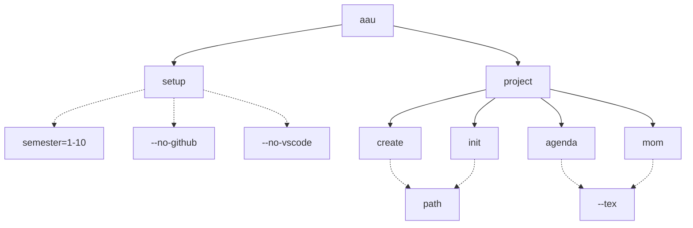

# AAU CLI
By students, for students. `aau` is a command-line utility for students at AAU, that makes project management a little easier.

## Commands
The commands and structure is shown in the diagram below. Dotted lines represent command options.

All commands can also end with `--help` to explain the command, subcommands and options.

### Project goals
`aau` has the following goals:

- Standardize setup of development environment.
- Automate project startup and administrative processes.
- Provide templates for the report, agenda, minutes(MoM), and settings.
- Be user friendly and extensible; education at AAU changes all the time.

### Todo
- Commands for authorization with AAU and GitHub.
- Standard LaTeX report template.
- Standard LaTeX and Markdown agenda and minutes template.
- Standard LaTeX and Markdown group and supervisor contract templates.
- Consider support for exporting to html/pdf (pandoc?).